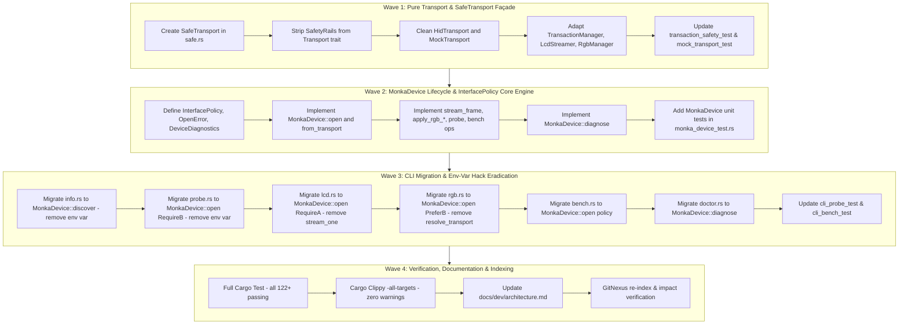

# Phase 6: Improve Architecture v1.0 - Pattern Mapping

**Phase:** 06 - improve-architecture-v1-0  
**Domain:** MonKey Architecture, Device Lifecycle & Hardware Abstraction  
**Primary Requirement:** ARCH-01  
**Source Decisions:** [06-CONTEXT.md](file:///Volumes/D/personal_project/MonkaKeyboard/.planning/phases/06-improve-architecture-v1-0/06-CONTEXT.md), [06-RESEARCH.md](file:///Volumes/D/personal_project/MonkaKeyboard/.planning/phases/06-improve-architecture-v1-0/06-RESEARCH.md)  
**Target Output:** `.planning/phases/06-improve-architecture-v1-0/06-PATTERNS.md`  

---

## Executive Summary & Design System

Phase 6 refactors the hardware interaction layer, device lifecycle, and safety boundaries of MonKey v1.0. It standardizes device discovery and opening across five CLI commands (`info`, `probe`, `lcd`, `rgb`, `bench`) and the diagnostic engine (`doctor`), replaces ad-hoc test seams and production environment variable hacks with a concrete `MonkaDevice` abstraction, and eliminates domain leakage from low-level byte adapters through a `SafeTransport` guard façade.

### Core Architectural Patterns

1. **Guard Façade Pattern (`SafeTransport<'a>`):**
   - Strips protocol domain knowledge (`&SafetyRails`) from the low-level `Transport` byte I/O trait.
   - Encapsulates `(&'a mut dyn Transport, &'a SafetyRails)` in a zero-cost RAII guard. Centralizes hardware write permission checks (`validate_hardware_write_permitted`) in exactly one location before forwarding byte writes to `write_bulk` or `send_feature_report`.
   - Supports zero-cost re-borrowing (`reborrow<'b>(&'b mut self) -> SafeTransport<'b>`) to allow sub-managers (`TransactionManager`) to be instantiated inside nested driver workflows (`RgbManager`) without borrow-checker conflicts.

2. **Concrete Deep Module Pattern (`MonkaDevice`):**
   - Defined as a concrete struct in `crates/monkey-core/src/device.rs` (NOT a trait or duplicate mock seam per D-01).
   - Internally owns both `Box<dyn Transport>` and `SafetyRails`.
   - Solves Rust's double-borrow constraint (`&mut transport` vs `&safety`) by manufacturing `SafeTransport` internally and exposing cohesive, coarse-grained operations (`stream_frame_with_progress`, `apply_rgb_preview`, `apply_rgb_commit`, `readback_rgb_status`, `probe`, `run_bulk_benchmark`, `run_transaction_benchmark`).
   - Retains `Transport` as the single test seam via `MonkaDevice::from_transport(Box<dyn Transport>)` for headless CLI testing (`--mock`).

3. **Policy-Driven Hardware Selection (`InterfacePolicy`):**
   - Replaces manual interface inspection and ad-hoc branching with a declarative enum (`PreferB`, `RequireA`, `RequireB`, `BulkFirst`, `ControlFirst`, `Any`).
   - Accurately captures true hardware variations between the bulk display pipe (`0xFF68:0x0061`) and control/RGB pipe (`0x000C:0x0001` / `0xFFFF:0x0001`).

4. **Layered Error Hierarchy & Diagnostic Engine (`OpenError` & `DeviceDiagnostics`):**
   - Hierarchical `OpenError` enum categorizes failures into initialization stages (`HidInit`, `NoDevice`, `InterfaceUnavailable`, `InterfaceOpenFailed`).
   - Seamlessly preserves CLI exit codes in `classify_error` (`NoDevice` -> 3, `Permission` -> 4, `Blocked` -> 5) with zero modifications required to `classify_error`.
   - Stage-by-stage non-fail-fast inspection via `MonkaDevice::diagnose() -> DeviceDiagnostics` allows `monkey doctor` to record Pass/Warn/Fail with tailored remediations across all checks without early returning.

---

## Complete File Inventory & Classification

| Target File | Action | Architectural Role | Data Flow | Closest Analog |
|---|---|---|---|---|
| `crates/monkey-core/src/transport/safe.rs` | **Create** | Guard Façade | Wraps `(&'a mut dyn Transport, &'a SafetyRails)` -> validates write permission -> delegates I/O | `crates/monkey-core/src/transport/mock.rs:113-158` |
| `crates/monkey-core/src/transport/mod.rs` | **Modify** | Trait Definition | Strips `&SafetyRails` from trait -> re-exports `SafeTransport` | Existing `transport/mod.rs:9-48` |
| `crates/monkey-core/src/transport/hid.rs` | **Modify** | Hardware Adapter | Pure byte I/O -> calls `hidapi::HidDevice::write` and `send_feature_report` | Existing `transport/hid.rs:148-209` |
| `crates/monkey-core/src/transport/mock.rs` | **Modify** | Mock Adapter | Pure byte I/O -> records `TransportCall`s without domain safety rails | Existing `transport/mock.rs:113-158` |
| `crates/monkey-core/src/protocol/transaction.rs` | **Modify** | Protocol Driver | Consumes `SafeTransport<'a>` -> validates opcodes -> delegates writes | Existing `protocol/transaction.rs:8-99` |
| `crates/monkey-core/src/protocol/channel.rs` | **Modify** | Worker Channel | Background thread wraps `SafeTransport` -> drives `TransactionManager` | Existing `protocol/channel.rs:24-58` |
| `crates/monkey-core/src/lcd/streamer.rs` | **Modify** | LCD Streaming Driver | Consumes `SafeTransport<'a>` -> writes 4096B chunks to Interface A | Existing `lcd/streamer.rs:89-153` |
| `crates/monkey-core/src/rgb/manager.rs` | **Modify** | RGB Subsystem Driver | Consumes `SafeTransport<'a>` -> reborrows for `TransactionManager` | Existing `rgb/manager.rs:10-121` |
| `crates/monkey-core/src/device.rs` | **Modify** | Device Lifecycle Engine | `InterfacePolicy` + `OpenError` + `DeviceDiagnostics` + `MonkaDevice` deep methods | Existing `device.rs:93-382` |
| `crates/monkey-core/src/doctor.rs` | **Modify** | Diagnostic Engine | Calls `MonkaDevice::diagnose()` -> maps to `DiagnosticCheck`s | Existing `doctor.rs:41-229` |
| `crates/monkey-core/src/lib.rs` | **Modify** | Library Re-exports | Exports `MonkaDevice`, `InterfacePolicy`, `OpenError`, `DeviceDiagnostics`, `SafeTransport` | Existing `src/lib.rs:1-45` |
| `crates/monkey-cli/src/commands/info.rs` | **Modify** | CLI Command Consumer | Calls `MonkaDevice::discover()` -> formats output (eradicates `MONKEY_SIMULATE_EMPTY`) | Existing `commands/info.rs:160-198` |
| `crates/monkey-cli/src/commands/probe.rs` | **Modify** | CLI Command Consumer | Calls `MonkaDevice::open(RequireB)` -> delegates to `device.probe()` | Existing `commands/probe.rs:198-258` |
| `crates/monkey-cli/src/commands/lcd.rs` | **Modify** | CLI Command Consumer | Calls `MonkaDevice::open(RequireA)` -> calls `device.stream_frame_with_progress` | Existing `commands/lcd.rs:222-346` |
| `crates/monkey-cli/src/commands/rgb.rs` | **Modify** | CLI Command Consumer | Calls `MonkaDevice::open(PreferB)` -> calls `device.apply_rgb_*` | Existing `commands/rgb.rs:136-233` |
| `crates/monkey-cli/src/commands/bench.rs` | **Modify** | CLI Command Consumer | Calls `MonkaDevice::open(policy)` -> drives benchmark methods | Existing `commands/bench.rs:145-221` |
| `crates/monkey-core/tests/transaction_safety_test.rs` | **Modify** | Test Suite | Adapts `RecordingTransport` to pure `Transport` + tests `SafeTransport` integration | Existing `transaction_safety_test.rs:12-72` |
| `crates/monkey-core/tests/mock_transport_test.rs` | **Modify** | Test Suite | Tests pure `MockTransport` + tests `SafeTransport` write denial | Existing `mock_transport_test.rs:5-60,221-238` |
| `crates/monkey-core/tests/lcd_test.rs` | **Modify** | Test Suite | Passes `SafeTransport` to `LcdStreamer::new` | Existing `lcd_test.rs:54-77` |
| `crates/monkey-core/tests/rgb_manager_test.rs` | **Modify** | Test Suite | Passes `SafeTransport` to `RgbManager::new` | Existing `rgb_manager_test.rs:9-36` |
| `crates/monkey-core/tests/monka_device_test.rs` | **Create** | Test Suite | Tests `MonkaDevice` lifecycle, `InterfacePolicy`, mock injection, error conversions | `crates/monkey-core/tests/device_discovery_test.rs` |
| `crates/monkey-cli/tests/cli_probe_test.rs` | **Modify** | Test Suite | Removes `MONKEY_SIMULATE_EMPTY` env tests -> tests `OpenError::NoDevice` exit codes | Existing `cli_probe_test.rs:218-266` |
| `docs/dev/architecture.md` | **Modify** | Architecture Doc | Updates component diagram, device abstraction contract, and safety flow | Existing `docs/dev/architecture.md` |

---

## Detailed File Pattern Mapping & Blueprints

### 1. Guard Façade: `SafeTransport<'a>` (`crates/monkey-core/src/transport/safe.rs`)

- **Role:** Centralized RAII write authorization gate.
- **Data Flow:** Holds `(&'a mut dyn Transport, &'a SafetyRails)`. Before calling `transport.write_bulk` or `transport.send_feature_report`, invokes `safety.validate_hardware_write_permitted()`. Exposes transparent read methods (`get_feature_report`, `read_input_report`). Exposes `reborrow<'b>(&'b mut self) -> SafeTransport<'b>` for nested construction.
- **Closest Analog:** `crates/monkey-core/src/transport/mock.rs:113-158` (which currently duplicates `safety.validate_hardware_write_permitted()` checks).
- **Existing Analog Code:**
  ```rust
  // crates/monkey-core/src/transport/mock.rs:120-123
  safety
      .validate_hardware_write_permitted()
      .map_err(|e| TransportError::ProtocolViolation(e.to_string()))?;
  ```
- **Target Blueprint (`crates/monkey-core/src/transport/safe.rs`):**
  ```rust
  use crate::error::TransportError;
  use crate::protocol::SafetyRails;
  use crate::transport::Transport;

  /// RAII guard façade wrapping a mutable Transport reference and an immutable SafetyRails reference.
  ///
  /// Guarantees compile-time safety: no bulk write or feature report can reach hardware
  /// or mock transport without passing through the centralized SafetyRails write authorization gate.
  pub struct SafeTransport<'a> {
      transport: &'a mut dyn Transport,
      safety: &'a SafetyRails,
  }

  impl<'a> SafeTransport<'a> {
      pub fn new(transport: &'a mut dyn Transport, safety: &'a SafetyRails) -> Self {
          Self { transport, safety }
      }

      /// Reborrows the underlying transport and safety references, allowing SafeTransport
      /// to be passed into nested sub-managers without losing ownership.
      pub fn reborrow<'b>(&'b mut self) -> SafeTransport<'b> {
          SafeTransport {
              transport: &mut *self.transport,
              safety: self.safety,
          }
      }

      /// Writes bulk data to the device with centralized write permission verification.
      pub fn write_bulk(
          &mut self,
          report_id: u8,
          data: &[u8],
      ) -> Result<usize, TransportError> {
          self.safety
              .validate_hardware_write_permitted()
              .map_err(|e| TransportError::ProtocolViolation(e.to_string()))?;
          self.transport.write_bulk(report_id, data)
      }

      /// Sends a feature report to the device with centralized write permission verification.
      pub fn send_feature_report(
          &mut self,
          data: &[u8],
      ) -> Result<(), TransportError> {
          self.safety
              .validate_hardware_write_permitted()
              .map_err(|e| TransportError::ProtocolViolation(e.to_string()))?;
          self.transport.send_feature_report(data)
      }

      /// Reads a feature report from the device (pure I/O query).
      pub fn get_feature_report(
          &mut self,
          report_id: u8,
          buf: &mut [u8],
      ) -> Result<usize, TransportError> {
          self.transport.get_feature_report(report_id, buf)
      }

      /// Reads an input report from the device with a timeout (pure I/O query).
      pub fn read_input_report(
          &mut self,
          buf: &mut [u8],
          timeout_ms: i32,
      ) -> Result<usize, TransportError> {
          self.transport.read_input_report(buf, timeout_ms)
      }

      /// Returns the underlying safety rails reference.
      pub fn safety(&self) -> &SafetyRails {
          self.safety
      }
  }
  ```

---

### 2. Pure Transport Trait & Low-Level Adapters

#### `crates/monkey-core/src/transport/mod.rs`
- **Role:** Pure I/O trait definition without domain types.
- **Data Flow:** Defines `write_bulk`, `send_feature_report`, `get_feature_report`, `read_input_report`. Declares `pub mod safe;` and re-exports `SafeTransport`.
- **Existing Analog Code (`crates/monkey-core/src/transport/mod.rs:12-26`):**
  ```rust
  pub trait Transport: Send {
      fn write_bulk(&mut self, report_id: u8, data: &[u8], safety: &SafetyRails) -> Result<usize, TransportError>;
      fn send_feature_report(&mut self, data: &[u8], safety: &SafetyRails) -> Result<(), TransportError>;
  ...
  ```
- **Target Blueprint (`crates/monkey-core/src/transport/mod.rs`):**
  ```rust
  pub mod hid;
  pub mod mock;
  pub mod safe;

  use crate::error::TransportError;
  pub use hid::{ConnectionState, HidTransport};
  pub use mock::{MockTransport, TransportCall};
  pub use safe::SafeTransport;

  /// Pure synchronous byte-level hardware transport abstraction.
  ///
  /// Low-level adapters (HidTransport, MockTransport) implement this trait with zero domain awareness.
  /// Safety authorization is enforced by the SafeTransport guard façade.
  pub trait Transport: Send {
      /// Writes bulk data to the device (Interface A bulk pipe). Pure byte I/O.
      fn write_bulk(
          &mut self,
          report_id: u8,
          data: &[u8],
      ) -> Result<usize, TransportError>;

      /// Sends a feature report to the device (Interface B control pipe). Pure byte I/O.
      fn send_feature_report(
          &mut self,
          data: &[u8],
      ) -> Result<(), TransportError>;

      /// Reads a feature report from the device (Interface B control pipe).
      fn get_feature_report(
          &mut self,
          report_id: u8,
          buf: &mut [u8],
      ) -> Result<usize, TransportError>;

      /// Reads an input report from the device with a millisecond timeout.
      fn read_input_report(
          &mut self,
          buf: &mut [u8],
          timeout_ms: i32,
      ) -> Result<usize, TransportError>;
  }
  ```

#### `crates/monkey-core/src/transport/hid.rs`
- **Role:** Darwin/IOKit HID hardware adapter.
- **Data Flow:** Removes `use crate::protocol::SafetyRails;`. Removes `safety` parameter and checks from `write_bulk` and `send_feature_report`. Calls `self.device.write(&buf)` and `self.device.send_feature_report(data)` directly.
- **Existing Analog Code (`crates/monkey-core/src/transport/hid.rs:152-178`):**
  ```rust
  fn write_bulk(&mut self, report_id: u8, data: &[u8], safety: &SafetyRails) -> Result<usize, TransportError> {
      safety.validate_hardware_write_permitted().map_err(|e| TransportError::ProtocolViolation(e.to_string()))?;
      let buf = Self::frame_bulk_buffer(report_id, data);
      let bytes_written = self.device.write(&buf).map_err(TransportError::from)?;
      Ok(Self::calculate_payload_written(bytes_written))
  }
  ```
- **Target Blueprint (`crates/monkey-core/src/transport/hid.rs`):**
  ```rust
  impl Transport for HidTransport {
      fn write_bulk(
          &mut self,
          report_id: u8,
          data: &[u8],
      ) -> Result<usize, TransportError> {
          let buf = Self::frame_bulk_buffer(report_id, data);
          let bytes_written = self.device.write(&buf).map_err(TransportError::from)?;
          Ok(Self::calculate_payload_written(bytes_written))
      }

      fn send_feature_report(
          &mut self,
          data: &[u8],
      ) -> Result<(), TransportError> {
          self.device
              .send_feature_report(data)
              .map_err(TransportError::from)
      }
      // get_feature_report and read_input_report unchanged
  }
  ```

#### `crates/monkey-core/src/transport/mock.rs`
- **Role:** Pure in-memory mock adapter.
- **Data Flow:** Removes `use crate::protocol::SafetyRails;`. Records calls to `self.calls` without requiring dummy safety rails.
- **Target Blueprint (`crates/monkey-core/src/transport/mock.rs`):**
  ```rust
  impl Transport for MockTransport {
      fn write_bulk(
          &mut self,
          report_id: u8,
          data: &[u8],
      ) -> Result<usize, TransportError> {
          if let Some(err) = &self.injected_error {
              return Err(err.clone());
          }
          if !self.suppress_recording {
              self.calls.push(TransportCall::WriteBulk {
                  report_id,
                  data: data.to_vec(),
              });
          }
          Ok(data.len())
      }

      fn send_feature_report(
          &mut self,
          data: &[u8],
      ) -> Result<(), TransportError> {
          if let Some(err) = &self.injected_error {
              return Err(err.clone());
          }
          if !self.suppress_recording {
              self.calls.push(TransportCall::SendFeature {
                  data: data.to_vec(),
              });
          }
          Ok(())
      }
      // get_feature_report and read_input_report unchanged
  }
  ```

---

### 3. Protocol & Subsystem Drivers (`TransactionManager`, `LcdStreamer`, `RgbManager`)

#### `crates/monkey-core/src/protocol/transaction.rs`
- **Role:** Protocol transaction and framing manager.
- **Data Flow:** Holds `transport: SafeTransport<'a>`. Validates command opcode against `self.transport.safety()`. Calls `self.transport.send_feature_report` and `self.transport.write_bulk`.
- **Existing Analog Code (`crates/monkey-core/src/protocol/transaction.rs:8-48`):**
  ```rust
  pub struct TransactionManager<'a> {
      transport: &'a mut dyn Transport,
      safety: &'a SafetyRails,
      inter_packet_delay: Duration,
      inter_chunk_delay: Duration,
  }
  ```
- **Target Blueprint (`crates/monkey-core/src/protocol/transaction.rs`):**
  ```rust
  pub struct TransactionManager<'a> {
      transport: SafeTransport<'a>,
      inter_packet_delay: Duration,
      inter_chunk_delay: Duration,
  }

  impl<'a> TransactionManager<'a> {
      pub fn new(transport: SafeTransport<'a>) -> Self {
          Self {
              transport,
              inter_packet_delay: Duration::from_millis(5),
              inter_chunk_delay: Duration::from_millis(15),
          }
      }

      pub fn with_delays(mut self, packet_delay: Duration, chunk_delay: Duration) -> Self {
          self.inter_packet_delay = packet_delay;
          self.inter_chunk_delay = chunk_delay;
          self
      }

      pub fn send_feature_command(
          &mut self,
          packet: &FeatureReportPacket,
          mode: WriteMode,
      ) -> Result<()> {
          packet.validate_header()?;
          self.transport.safety().validate_write(packet.command, mode)?;

          self.transport
              .send_feature_report(packet.as_bytes())
              .map_err(MonkeyError::Transport)?;

          if !self.inter_packet_delay.is_zero() {
              std::thread::sleep(self.inter_packet_delay);
          }
          Ok(())
      }

      pub fn stream_bulk_chunks<F>(
          &mut self,
          chunks: &[BulkChunkPacket],
          mut on_chunk_sent: F,
      ) -> Result<Duration>
      where
          F: FnMut(usize, usize),
      {
          self.transport.safety().validate_hardware_write_permitted()?;
          let _expected_crc = calculate_chunks_crc16(chunks);
          let start = Instant::now();
          let total = chunks.len();

          for (idx, chunk) in chunks.iter().enumerate() {
              let written = self
                  .transport
                  .write_bulk(VendorReportId::BulkOut as u8, &chunk.data)
                  .map_err(|err| {
                      MonkeyError::Transport(TransportError::IoError(format!(
                          "Bulk chunk {}/{} failed: {}",
                          idx + 1, total, err
                      )))
                  })?;

              if written != chunk.data.len() {
                  return Err(MonkeyError::Transport(TransportError::IoError(format!(
                      "Bulk chunk {}/{} incomplete: wrote {} of {} bytes",
                      idx + 1, total, written, chunk.data.len()
                  ))));
              }

              on_chunk_sent(idx + 1, total);
              if idx + 1 < total && !self.inter_chunk_delay.is_zero() {
                  std::thread::sleep(self.inter_chunk_delay);
              }
          }
          Ok(start.elapsed())
      }
  }
  ```

#### `crates/monkey-core/src/lcd/streamer.rs`
- **Role:** Paced bulk LCD frame streamer.
- **Data Flow:** Holds `transport: SafeTransport<'a>`. Validates write consent at construction and frame sending. Calls `self.transport.write_bulk(LCD_INTERFACE_A_REPORT_ID, chunk)`.
- **Target Blueprint (`crates/monkey-core/src/lcd/streamer.rs:89-153`):**
  ```rust
  pub struct LcdStreamer<'a> {
      transport: SafeTransport<'a>,
      pub config: LcdPacingConfig,
  }

  impl<'a> LcdStreamer<'a> {
      pub fn new(
          transport: SafeTransport<'a>,
          config: LcdPacingConfig,
      ) -> Result<Self> {
          config.validate()?;
          transport.safety().validate_hardware_write_permitted()?;
          Ok(Self {
              transport,
              config,
          })
      }

      pub fn send_frame(&mut self, frame: &[u8; LCD_FRAME_BYTES]) -> Result<LcdStreamMetrics> {
          self.send_frame_with_progress(frame, |_, _| {})
      }

      pub fn send_frame_with_progress<F>(
          &mut self,
          frame: &[u8; LCD_FRAME_BYTES],
          mut on_chunk: F,
      ) -> Result<LcdStreamMetrics>
      where
          F: FnMut(usize, usize),
      {
          self.transport.safety().validate_hardware_write_permitted()?;
          let start = Instant::now();
          let chunks = FrameChunker::new(frame)?;
          let mut sent = 0usize;
          for chunk in chunks {
              let written = self
                  .transport
                  .write_bulk(LCD_INTERFACE_A_REPORT_ID, chunk)
                  .map_err(MonkeyError::Transport)?;
              if written != LCD_CHUNK_SIZE {
                  return Err(MonkeyError::Transport(TransportError::IoError(format!(
                      "LCD chunk {} short write: expected {}, wrote {}",
                      sent + 1, LCD_CHUNK_SIZE, written
                  ))));
              }
              sent += 1;
              on_chunk(sent, LCD_CHUNK_COUNT);
              if sent < LCD_CHUNK_COUNT && !self.config.inter_chunk_delay.is_zero() {
                  thread::sleep(self.config.inter_chunk_delay);
              }
          }
          Ok(LcdStreamMetrics {
              chunks_sent: sent,
              bytes_sent: sent * LCD_CHUNK_SIZE,
              elapsed: start.elapsed(),
          })
      }
  }
  ```

#### `crates/monkey-core/src/rgb/manager.rs`
- **Role:** RGB lighting controller.
- **Data Flow:** Holds `transport: SafeTransport<'a>`. Constructs `TransactionManager::new(self.transport.reborrow())`. Calls `self.transport.get_feature_report(0x04, &mut buf)` for readback.
- **Target Blueprint (`crates/monkey-core/src/rgb/manager.rs:10-121`):**
  ```rust
  pub struct RgbManager<'a> {
      transport: SafeTransport<'a>,
      session_flash_commits: AtomicU64,
  }

  impl<'a> RgbManager<'a> {
      pub fn new(transport: SafeTransport<'a>) -> Self {
          Self {
              transport,
              session_flash_commits: AtomicU64::new(0),
          }
      }

      pub fn session_flash_commit_count(&self) -> u64 {
          self.session_flash_commits.load(Ordering::Relaxed)
      }

      pub fn apply_preview(&mut self, config: &LightingConfig) -> Result<()> {
          config.validate()?;
          let packet = encode_rgb_control_packet(config)?;

          let mut tx = TransactionManager::new(self.transport.reborrow());
          tx.send_feature_command(&packet, WriteMode::RamPreview)?;

          self.transport.safety().set_ram_preview_verified(true);
          Ok(())
      }

      pub fn apply_commit(
          &mut self,
          config: &LightingConfig,
          is_wireless: bool,
          battery_percent: Option<u8>,
          force: bool,
      ) -> Result<()> {
          config.validate()?;

          if is_wireless && battery_percent.is_some_and(|b| b < 20) && !force {
              let b = battery_percent.unwrap_or(0);
              return Err(MonkeyError::SafetyViolation(format!(
                  "Flash commit blocked: Battery is at {}% (< 20%) on wireless transport. Connect USB cable to charge, or pass --force to override at your own risk.",
                  b
              )));
          }

          let packet = encode_rgb_control_packet(config)?;
          self.transport.safety().set_transaction_active(true);
          self.transport.safety().set_ram_preview_verified(true);

          let mut tx = TransactionManager::new(self.transport.reborrow());
          let start_pkt = FeatureReportPacket::new(CommandId::StartTransaction as u8);
          if let Err(e) = tx.send_feature_command(&start_pkt, WriteMode::RamPreview) {
              self.transport.safety().set_transaction_active(false);
              return Err(e);
          }

          if let Err(e) = tx.send_feature_command(&packet, WriteMode::RamPreview) {
              let end_pkt = FeatureReportPacket::new(CommandId::EndTransaction as u8);
              let _ = tx.send_feature_command(&end_pkt, WriteMode::RamPreview);
              self.transport.safety().set_transaction_active(false);
              return Err(e);
          }

          let save_pkt = FeatureReportPacket::new(CommandId::SaveSettings as u8);
          if let Err(e) = tx.send_feature_command(&save_pkt, WriteMode::FlashCommit) {
              let end_pkt = FeatureReportPacket::new(CommandId::EndTransaction as u8);
              let _ = tx.send_feature_command(&end_pkt, WriteMode::RamPreview);
              self.transport.safety().set_transaction_active(false);
              return Err(e);
          }

          let end_pkt = FeatureReportPacket::new(CommandId::EndTransaction as u8);
          let end_res = tx.send_feature_command(&end_pkt, WriteMode::RamPreview);
          self.transport.safety().set_transaction_active(false);
          end_res?;

          self.session_flash_commits.fetch_add(1, Ordering::Relaxed);
          Ok(())
      }

      pub fn readback_status(&mut self) -> Result<Option<LightingConfig>> {
          let mut buf = [0u8; FEATURE_REPORT_SIZE];
          let read_res = self.transport.get_feature_report(0x04, &mut buf);
          match read_res {
              Ok(read_bytes) if read_bytes >= FEATURE_REPORT_SIZE => {
                  match decode_rgb_control_packet(&buf) {
                      Ok(cfg) => Ok(Some(cfg)),
                      Err(_) => Ok(None),
                  }
              }
              Ok(_) => Ok(None),
              Err(TransportError::InvalidReportId(_)) => Ok(None),
              Err(e) => Err(MonkeyError::Transport(e)),
          }
      }
  }
  ```

---

### 4. Device Lifecycle, Interface Policy & Diagnostics (`crates/monkey-core/src/device.rs`)

- **Role:** Central hardware device coordinator, interface policy resolver, and diagnostic engine.
- **Data Flow:**
  - `MonkaDevice::open(policy)` initializes HID, finds device sets, selects interface per `InterfacePolicy`, opens device path, returns initialized `MonkaDevice`.
  - `MonkaDevice::from_transport(transport)` creates test/headless instance with builder methods (`with_device_set`, `with_hardware_writes_allowed`, `with_wireless`).
  - `MonkaDevice::diagnose()` probes HID init, device set detection, interface A open, and interface B open without early returns.
  - Deep operations manufacture `SafeTransport` and invoke sub-drivers directly.
- **Target Blueprint (`crates/monkey-core/src/device.rs` additions):**
  ```rust
  use crate::error::{MonkeyError, Result, TransportError};
  use crate::lcd::{LcdPacingConfig, LcdStreamMetrics, LcdStreamer, LCD_FRAME_BYTES};
  use crate::protocol::safety::{SafetyRails, WriteMode};
  use crate::protocol::types::FeatureReportPacket;
  use crate::rgb::{LightingConfig, RgbManager};
  use crate::transport::{HidTransport, SafeTransport, Transport};
  use crate::bench::{BenchmarkConfig, LatencyReport, ThroughputReport};

  /// Declarative interface selection policy for Monka 3075 Pro hardware endpoints.
  #[derive(Debug, Clone, Copy, PartialEq, Eq)]
  pub enum InterfacePolicy {
      /// Interface B first, fallback to Interface A (used by `rgb`).
      PreferB,
      /// Interface A only; hard fail if missing (used by `lcd`).
      RequireA,
      /// Interface B only; hard fail if missing (used by `probe`).
      RequireB,
      /// Interface A then Interface B (used by `bench` when running bulk transfers).
      BulkFirst,
      /// Interface B then Interface A (used by `bench` when running feature/transaction transfers).
      ControlFirst,
      /// Open whatever valid Monka interface is available.
      Any,
  }

  /// Granular error variants representing hardware device initialization stages.
  #[derive(Debug, thiserror::Error)]
  pub enum OpenError {
      #[error("Failed to initialize HID subsystem: {0}")]
      HidInit(#[from] TransportError),

      #[error("No Monka 3075 Pro / RKGK890 keyboard detected (VID: 0x{MONKA_VID:04x}, PID: 0x{MONKA_PID:04x}). Please check USB connection.")]
      NoDevice,

      #[error("Requested interface {0:?} is not available on detected keyboard")]
      InterfaceUnavailable(InterfaceRole),

      #[error("Failed to open interface {0:?}: {1}")]
      InterfaceOpenFailed(InterfaceRole, TransportError),
  }

  /// Non-fail-fast diagnostic inspection tree evaluated by `MonkaDevice::diagnose()`.
  #[derive(Debug)]
  pub struct DeviceDiagnostics {
      pub hid_init: Result<(), TransportError>,
      pub device_set: Option<MonkaDeviceSet>,
      pub interface_a_status: InterfaceCheckStatus,
      pub interface_b_status: InterfaceCheckStatus,
  }

  #[derive(Debug, Clone)]
  pub enum InterfaceCheckStatus {
      NotPresent,
      OpenSuccess,
      OpenFailed(TransportError),
  }

  /// Structured output of capability probe inspection.
  #[derive(Debug, Clone, Serialize, Deserialize, PartialEq, Eq)]
  pub struct ProbeOutput {
      pub model: String,
      pub hardware_revision: String,
      pub firmware_version: String,
      pub transport_state: String,
      pub capabilities: Vec<String>,
      pub interface_a_detected: bool,
      pub interface_b_detected: bool,
      pub read_only_verified: bool,
  }

  /// Concrete hardware device handle encapsulating transport I/O and safety rails.
  pub struct MonkaDevice {
      transport: Box<dyn Transport>,
      safety: SafetyRails,
      device_set: Option<MonkaDeviceSet>,
      role: Option<InterfaceRole>,
      is_wireless: bool,
  }

  impl MonkaDevice {
      /// Opens a physical Monka keyboard handle matching the specified interface policy.
      pub fn open(policy: InterfacePolicy) -> Result<Self, OpenError> {
          let api = init_hidapi().map_err(OpenError::HidInit)?;
          let sets = find_monka_device_sets(&api);
          let device_set = sets.into_iter().next().ok_or(OpenError::NoDevice)?;
          let is_wireless = device_set.is_wireless();

          let (target_dev, role) = Self::resolve_policy(&device_set, policy)?;
          let hid_dev = open_device_path(&api, &target_dev)
              .map_err(|e| OpenError::InterfaceOpenFailed(role, e))?;

          Ok(Self {
              transport: Box::new(HidTransport::new(hid_dev)),
              safety: SafetyRails::new(),
              device_set: Some(device_set),
              role: Some(role),
              is_wireless,
          })
      }

      /// Creates a MonkaDevice from an existing transport implementation (for headless testing and mocks).
      pub fn from_transport(transport: Box<dyn Transport>) -> Self {
          Self {
              transport,
              safety: SafetyRails::new(),
              device_set: None,
              role: None,
              is_wireless: false,
          }
      }

      /// Builder helper to attach mock device set metadata.
      #[must_use]
      pub fn with_device_set(mut self, device_set: MonkaDeviceSet) -> Self {
          self.device_set = Some(device_set);
          self
      }

      /// Builder helper to configure hardware write consent.
      #[must_use]
      pub fn with_hardware_writes_allowed(self, allowed: bool) -> Self {
          self.safety.set_hardware_writes_allowed(allowed);
          self
      }

      /// Builder helper to declare wireless transport status.
      #[must_use]
      pub fn with_wireless(mut self, wireless: bool) -> Self {
          self.is_wireless = wireless;
          self
      }

      /// Discovers connected Monka device sets without opening endpoint handles.
      pub fn discover() -> Result<Vec<MonkaDeviceSet>, OpenError> {
          let api = init_hidapi().map_err(OpenError::HidInit)?;
          Ok(find_monka_device_sets(&api))
      }

      /// Manufactures an internal SafeTransport guard for deep driver operations.
      pub fn safe_transport(&mut self) -> SafeTransport<'_> {
          SafeTransport::new(&mut *self.transport, &self.safety)
      }

      /// Returns whether the device is connected wirelessly.
      pub fn is_wireless(&self) -> bool {
          self.is_wireless
      }

      /// Returns the active interface role, if opened via policy.
      pub fn role(&self) -> Option<InterfaceRole> {
          self.role
      }

      /// Resolves target device descriptor and role based on the interface policy.
      fn resolve_policy(
          set: &MonkaDeviceSet,
          policy: InterfacePolicy,
      ) -> Result<(DiscoveredDevice, InterfaceRole), OpenError> {
          match policy {
              InterfacePolicy::RequireA => {
                  let dev = set.interface_a.clone().ok_or(OpenError::InterfaceUnavailable(InterfaceRole::InterfaceA))?;
                  Ok((dev, InterfaceRole::InterfaceA))
              }
              InterfacePolicy::RequireB => {
                  let dev = set.interface_b.clone().ok_or(OpenError::InterfaceUnavailable(InterfaceRole::InterfaceB))?;
                  Ok((dev, InterfaceRole::InterfaceB))
              }
              InterfacePolicy::PreferB => {
                  if let Some(b) = &set.interface_b {
                      Ok((b.clone(), InterfaceRole::InterfaceB))
                  } else if let Some(a) = &set.interface_a {
                      Ok((a.clone(), InterfaceRole::InterfaceA))
                  } else {
                      Err(OpenError::InterfaceUnavailable(InterfaceRole::InterfaceB))
                  }
              }
              InterfacePolicy::BulkFirst => {
                  if let Some(a) = &set.interface_a {
                      Ok((a.clone(), InterfaceRole::InterfaceA))
                  } else if let Some(b) = &set.interface_b {
                      Ok((b.clone(), InterfaceRole::InterfaceB))
                  } else {
                      Err(OpenError::InterfaceUnavailable(InterfaceRole::InterfaceA))
                  }
              }
              InterfacePolicy::ControlFirst | InterfacePolicy::Any => {
                  if let Some(b) = &set.interface_b {
                      Ok((b.clone(), InterfaceRole::InterfaceB))
                  } else if let Some(a) = &set.interface_a {
                      Ok((a.clone(), InterfaceRole::InterfaceA))
                  } else {
                      Err(OpenError::InterfaceUnavailable(InterfaceRole::InterfaceB))
                  }
              }
          }
      }

      /// Executes multi-stage non-fail-fast diagnostic inspection for `monkey doctor`.
      pub fn diagnose() -> DeviceDiagnostics {
          let api = match init_hidapi() {
              Ok(api) => api,
              Err(e) => {
                  return DeviceDiagnostics {
                      hid_init: Err(e),
                      device_set: None,
                      interface_a_status: InterfaceCheckStatus::NotPresent,
                      interface_b_status: InterfaceCheckStatus::NotPresent,
                  };
              }
          };

          let sets = find_monka_device_sets(&api);
          let device_set = sets.into_iter().next();

          let (interface_a_status, interface_b_status) = if let Some(ref set) = device_set {
              let status_a = match set.interface_a {
                  Some(ref dev_a) => match open_device_path(&api, dev_a) {
                      Ok(_) => InterfaceCheckStatus::OpenSuccess,
                      Err(e) => InterfaceCheckStatus::OpenFailed(e),
                  },
                  None => InterfaceCheckStatus::NotPresent,
              };

              let status_b = match set.interface_b {
                  Some(ref dev_b) => match open_device_path(&api, dev_b) {
                      Ok(_) => InterfaceCheckStatus::OpenSuccess,
                      Err(e) => InterfaceCheckStatus::OpenFailed(e),
                  },
                  None => InterfaceCheckStatus::NotPresent,
              };

              (status_a, status_b)
          } else {
              (InterfaceCheckStatus::NotPresent, InterfaceCheckStatus::NotPresent)
          };

          DeviceDiagnostics {
              hid_init: Ok(()),
              device_set,
              interface_a_status,
              interface_b_status,
          }
      }

      // --- Deep Module Operations ---

      pub fn stream_frame_with_progress<F>(
          &mut self,
          frame: &[u8; LCD_FRAME_BYTES],
          config: LcdPacingConfig,
          on_chunk: F,
      ) -> Result<LcdStreamMetrics>
      where
          F: FnMut(usize, usize),
      {
          let mut streamer = LcdStreamer::new(self.safe_transport(), config)?;
          streamer.send_frame_with_progress(frame, on_chunk)
      }

      pub fn apply_rgb_preview(&mut self, config: &LightingConfig) -> Result<()> {
          let mut manager = RgbManager::new(self.safe_transport());
          manager.apply_preview(config)
      }

      pub fn apply_rgb_commit(
          &mut self,
          config: &LightingConfig,
          is_wireless: bool,
          battery: Option<u8>,
          force: bool,
      ) -> Result<()> {
          let mut manager = RgbManager::new(self.safe_transport());
          manager.apply_commit(config, is_wireless, battery, force)
      }

      pub fn readback_rgb_status(&mut self) -> Result<Option<LightingConfig>> {
          let mut manager = RgbManager::new(self.safe_transport());
          manager.readback_status()
      }

      pub fn probe(&mut self) -> Result<ProbeOutput, MonkeyError> {
          let mut probe_buf = [0u8; 65];
          let query_res = self.transport.get_feature_report(0, &mut probe_buf);

          let transport_state = match HidTransport::evaluate_state_query(
              self.is_wireless,
              query_res.as_ref().map(|&n| n).map_err(|e| e.clone()),
          ) {
              Ok(state) => format!("{state:?}"),
              Err(e) => {
                  tracing::warn!("Failed to query device feature report during probe: {e}");
                  format!("Unknown/Error: {e}")
              }
          };

          let (interface_a, interface_b) = match self.device_set {
              Some(ref set) => (set.has_interface_a(), set.has_interface_b()),
              None => (false, false),
          };

          let (hw_rev, fw_ver) = match query_res {
              Ok(n) if n > 0 => crate::device::parse_probe_response(&probe_buf[..n]),
              _ => ("unknown".to_string(), "unknown".to_string()),
          };

          let capabilities = crate::device::determine_capabilities(interface_a, interface_b);

          Ok(ProbeOutput {
              model: "Monka 3075 Pro / RKGK890".to_string(),
              hardware_revision: hw_rev,
              firmware_version: fw_ver,
              transport_state,
              capabilities,
              interface_a_detected: interface_a,
              interface_b_detected: interface_b,
              read_only_verified: true,
          })
      }

      pub fn run_bulk_benchmark<F>(
          &mut self,
          config: &BenchmarkConfig,
          on_frame: F,
      ) -> Result<ThroughputReport>
      where
          F: FnMut(usize, usize),
      {
          crate::bench::run_bulk_streaming_bench_with_safe_transport(
              self.safe_transport(),
              config,
              on_frame,
          )
      }

      pub fn run_transaction_benchmark<F>(
          &mut self,
          config: &BenchmarkConfig,
          on_sample: F,
      ) -> Result<LatencyReport>
      where
          F: FnMut(usize, usize),
      {
          crate::bench::run_transaction_latency_bench_with_safe_transport(
              self.safe_transport(),
              config,
              on_sample,
          )
      }
  }
  ```

---

### 5. CLI Command Consumers

#### `crates/monkey-cli/src/commands/info.rs`
- **Role:** CLI device info renderer.
- **Modifications:**
  - Eradicate `std::env::var("MONKEY_SIMULATE_EMPTY")` [CITED: D-05].
  - Replace `init_hidapi()` and `find_monka_device_sets(&api)` with `MonkaDevice::discover()?`.
- **Target Blueprint (`crates/monkey-cli/src/commands/info.rs:160-186`):**
  ```rust
  pub fn run_info_with_writer<W: Write>(format: OutputFormat, writer: &mut W) -> anyhow::Result<()> {
      let sets = MonkaDevice::discover().context("Failed to scan for Monka HID devices")?;

      if sets.is_empty() {
          return Err(OpenError::NoDevice.into());
      }

      if sets.len() > 1 {
          tracing::warn!(
              "Multiple Monka keyboards detected ({} sets found); inspecting first detected device",
              sets.len()
          );
      }

      run_info_with_device_set(&sets[0], format, writer)
  }
  ```

#### `crates/monkey-cli/src/commands/probe.rs`
- **Role:** CLI device capability prober.
- **Modifications:**
  - Eradicate `MONKEY_SIMULATE_EMPTY` [CITED: D-05].
  - Replace manual device opening and ad-hoc `run_probe_with_transport` seam with `MonkaDevice::open(InterfacePolicy::RequireB)`.
  - In mock/fallback cases, use `MonkaDevice::from_transport(Box::new(mock)).probe()`.
- **Target Blueprint (`crates/monkey-cli/src/commands/probe.rs:198-258`):**
  ```rust
  pub fn run_probe_with_writer<W: Write>(format: OutputFormat, writer: &mut W) -> anyhow::Result<()> {
      let probe_output = match MonkaDevice::open(InterfacePolicy::RequireB) {
          Ok(mut device) => device.probe()?,
          Err(OpenError::NoDevice) => return Err(OpenError::NoDevice.into()),
          Err(OpenError::InterfaceUnavailable(_) | OpenError::InterfaceOpenFailed(_, _)) => {
              tracing::warn!("Interface B not accessible; falling back to descriptor inspection");
              let sets = MonkaDevice::discover().unwrap_or_default();
              build_descriptor_only_probe_output(sets.first())
          }
          Err(e) => return Err(e.into()),
      };

      let human = format_probe_human(&probe_output);
      format.write_to(writer, &human, &probe_output)?;
      Ok(())
  }
  ```

#### `crates/monkey-cli/src/commands/lcd.rs`
- **Role:** CLI LCD image, animation, and test pattern streamer.
- **Modifications:**
  - Eradicate `open_lcd_transport()` and ad-hoc `stream_one()` seam.
  - Acquire hardware via `MonkaDevice::open(InterfacePolicy::RequireA)` and configure write consent.
  - Stream frames via `device.stream_frame_with_progress(&frame, config, on_progress)`.
- **Target Blueprint (`crates/monkey-cli/src/commands/lcd.rs`):**
  ```rust
  fn run_test_pattern<W: Write>(args: PatternArgs, format: OutputFormat, writer: &mut W) -> anyhow::Result<()> {
      let frame = generate_test_pattern_with_format(args.pattern.into_core(), !args.big_endian);
      let config = pacing(args.inter_chunk_delay_ms, DEFAULT_LCD_FPS)?;

      let mut device = if args.mock {
          MonkaDevice::from_transport(Box::new(MockTransport::new()))
              .with_hardware_writes_allowed(true)
      } else {
          require_write_consent(args.allow_hardware_writes)?;
          MonkaDevice::open(InterfacePolicy::RequireA)?
              .with_hardware_writes_allowed(true)
      };

      let bar = if format == OutputFormat::Human {
          let b = ProgressBar::new(monkey_core::lcd::LCD_CHUNK_COUNT as u64);
          if let Ok(style) = ProgressStyle::with_template("  LCD chunks [{bar:32}] {pos}/{len}") {
              b.set_style(style.progress_chars("=> "));
          }
          Some(b)
      } else {
          None
      };

      let started = Instant::now();
      let metrics = device.stream_frame_with_progress(&frame, config, |done, _| {
          if let Some(ref b) = bar {
              b.set_position(done as u64);
          }
      })?;
      if let Some(b) = bar {
          b.finish_and_clear();
      }

      let report = LcdReport {
          operation: "test-pattern".to_string(),
          target: if args.mock { "mock".to_string() } else { "hardware".to_string() },
          frames: 1,
          chunks_per_frame: metrics.chunks_sent,
          bytes_sent: metrics.bytes_sent,
          dither: false,
          little_endian: !args.big_endian,
          elapsed_ms: started.elapsed().as_secs_f64() * 1000.0,
      };
      write_report(writer, format, report)
  }
  ```

#### `crates/monkey-cli/src/commands/rgb.rs`
- **Role:** CLI RGB configuration, profile, and readback manager.
- **Modifications:**
  - Eradicate `resolve_transport` and manual `TransportResolution` struct [CITED: D-05].
  - Standardize on `MonkaDevice::open(InterfacePolicy::PreferB)`.
  - Directly invoke `device.apply_rgb_preview`, `device.apply_rgb_commit`, and `device.readback_rgb_status`.
- **Target Blueprint (`crates/monkey-cli/src/commands/rgb.rs`):**
  ```rust
  fn resolve_device(mock: bool, allow_hardware_writes: bool, requires_write: bool) -> Result<MonkaDevice> {
      if mock {
          return Ok(MonkaDevice::from_transport(Box::new(MockTransport::new()))
              .with_hardware_writes_allowed(true));
      }

      if requires_write && !allow_hardware_writes {
          bail!(
              "Hardware writes require explicit consent. Re-run with `--allow-hardware-writes` to modify keyboard RGB settings, or use `--mock` for headless testing."
          );
      }

      let device = MonkaDevice::open(InterfacePolicy::PreferB)?
          .with_hardware_writes_allowed(true);
      Ok(device)
  }

  fn run_set(args: SetArgs, format: OutputFormat) -> Result<()> {
      let config = build_lighting_config(&args)?;
      let mut device = resolve_device(args.mock, args.allow_hardware_writes, true)?;

      let write_mode_str = if args.commit {
          device
              .apply_rgb_commit(&config, device.is_wireless(), None, args.force)
              .context("Failed to commit RGB configuration to flash")?;
          "FlashCommit (Permanent)"
      } else {
          device
              .apply_rgb_preview(&config)
              .context("Failed to apply RGB preview to RAM")?;
          "RamPreview (Volatile)"
      };

      render_rgb_status(&config, write_mode_str, format)
  }
  ```

#### `crates/monkey-cli/src/commands/bench.rs`
- **Role:** CLI throughput and latency benchmarking harness.
- **Modifications:**
  - Eradicate ad-hoc `run_bench_with_transport` test seam.
  - Standardize on `InterfacePolicy::BulkFirst` for bulk tests and `InterfacePolicy::ControlFirst` for transaction latency tests.
- **Target Blueprint (`crates/monkey-cli/src/commands/bench.rs`):**
  ```rust
  pub fn run_bench_command<W: Write>(
      args: BenchArgs,
      format: OutputFormat,
      writer: &mut W,
  ) -> anyhow::Result<()> {
      let config = build_bench_config(&args)?;
      let policy = if args.bench_type.runs_bulk() {
          InterfacePolicy::BulkFirst
      } else {
          InterfacePolicy::ControlFirst
      };

      let mut device = if args.mock {
          let mut mock = MockTransport::new();
          mock.set_recording(false);
          MonkaDevice::from_transport(Box::new(mock))
              .with_hardware_writes_allowed(true)
      } else {
          if args.bench_type.runs_bulk() {
              require_write_consent(args.allow_hardware_writes)?;
          }
          MonkaDevice::open(policy)?
              .with_hardware_writes_allowed(true)
      };

      let throughput = if args.bench_type.runs_bulk() {
          let bar = progress_bar(format, config.frame_count as u64, "streaming frames");
          let report = device.run_bulk_benchmark(&config, |done, _| bar.set_position(done as u64))?;
          bar.finish_and_clear();
          Some(report)
      } else {
          None
      };

      let latency = if args.bench_type.runs_transaction() {
          let bar = progress_bar(format, config.iterations as u64, "sampling sends");
          let report = device.run_transaction_benchmark(&config, |done, _| bar.set_position(done as u64))?;
          bar.finish_and_clear();
          Some(report)
      } else {
          None
      };

      let report = BenchmarkReport {
          target: if args.mock { "mock".into() } else { "hardware".into() },
          bench_type: args.bench_type.as_str().into(),
          config: BenchConfigSummary::from(&config),
          throughput,
          latency,
      };

      format.write_to(writer, &format_bench_human(&report), &report)
  }
  ```

---

### 6. Diagnostic Engine Refactoring (`crates/monkey-core/src/doctor.rs`)

- **Role:** Non-fail-fast system and environmental diagnostics.
- **Data Flow:** Replaces direct calls to `init_hidapi()`, `find_monka_device_sets()`, and `open_device_path()` with `MonkaDevice::diagnose()`. Maps `DeviceDiagnostics` records into `DiagnosticCheck` results without early returns.
- **Existing Analog Code (`crates/monkey-core/src/doctor.rs:63-209`):**
  Currently calls raw HID functions inside `run_doctor_checks`.
- **Target Blueprint (`crates/monkey-core/src/doctor.rs:41-229`):**
  ```rust
  pub fn run_doctor_checks(mock: bool) -> DoctorReport {
      let os = std::env::consts::OS.to_string();
      let arch = std::env::consts::ARCH.to_string();
      let platform = format!("{}-{}", os, arch);

      if mock {
          return generate_mock_doctor_report(&platform, &os, &arch);
      }

      let mut checks = Vec::new();

      // 1. Host Platform Check
      checks.push(DiagnosticCheck {
          id: "platform".into(),
          name: "Host Operating System".into(),
          status: CheckStatus::Pass,
          message: format!("Platform {} ({}) supported", os, arch),
          remediation: None,
      });

      // Delegate hardware inspection to MonkaDevice::diagnose()
      let diag = MonkaDevice::diagnose();

      // 2. HID Subsystem Initialization
      match diag.hid_init {
          Ok(()) => {
              let backend_desc = if cfg!(target_os = "macos") {
                  "IOHIDManager (macOS Darwin)"
              } else if cfg!(target_os = "linux") {
                  "hidraw (Linux)"
              } else if cfg!(target_os = "windows") {
                  "Win32 HID"
              } else {
                  "generic hidapi"
              };
              checks.push(DiagnosticCheck {
                  id: "hid_subsystem".into(),
                  name: "USB HID Subsystem".into(),
                  status: CheckStatus::Pass,
                  message: format!("HIDAPI initialized successfully via {}", backend_desc),
                  remediation: None,
              });
          }
          Err(e) => {
              checks.push(DiagnosticCheck {
                  id: "hid_subsystem".into(),
                  name: "USB HID Subsystem".into(),
                  status: CheckStatus::Fail,
                  message: format!("Failed to initialize HID subsystem: {}", e),
                  remediation: Some(
                      "Check OS permissions or restart the operating system HID daemon.".into(),
                  ),
              });
          }
      }

      // 3. Monka 3075 Pro Enumeration
      if let Some(ref set) = diag.device_set {
          let conn_type = if set.is_wireless() {
              "2.4GHz Wireless Dongle"
          } else {
              "USB Wired"
          };
          checks.push(DiagnosticCheck {
              id: "device_enumeration".into(),
              name: "Keyboard Detection".into(),
              status: CheckStatus::Pass,
              message: format!("Monka 3075 Pro / RKGK890 detected (Connection: {})", conn_type),
              remediation: None,
          });

          // 4. Interface A: Bulk LCD Display Pipe
          match diag.interface_a_status {
              InterfaceCheckStatus::OpenSuccess => {
                  checks.push(DiagnosticCheck {
                      id: "interface_a".into(),
                      name: "Interface A (Bulk Display Pipe)".into(),
                      status: CheckStatus::Pass,
                      message: "Interface A (Usage Page 0xFF68, Usage 0x61) accessible (4096-byte OUT reports supported without TCC prompts).".into(),
                      remediation: None,
                  });
              }
              InterfaceCheckStatus::OpenFailed(e) => {
                  checks.push(DiagnosticCheck {
                      id: "interface_a".into(),
                      name: "Interface A (Bulk Display Pipe)".into(),
                      status: CheckStatus::Fail,
                      message: format!("Cannot open Interface A device path: {}", e),
                      remediation: Some("Check if another process has claimed exclusive access to the USB bulk interface.".into()),
                  });
              }
              InterfaceCheckStatus::NotPresent => {
                  checks.push(DiagnosticCheck {
                      id: "interface_a".into(),
                      name: "Interface A (Bulk Display Pipe)".into(),
                      status: CheckStatus::Warn,
                      message: "Interface A not found in active device set.".into(),
                      remediation: Some("LCD frame rendering requires Interface A. In wireless mode, verify the wireless dongle firmware supports bulk display piping.".into()),
                  });
              }
          }

          // 5. Interface B: Control & Configuration Pipe
          match diag.interface_b_status {
              InterfaceCheckStatus::OpenSuccess => {
                  checks.push(DiagnosticCheck {
                      id: "interface_b".into(),
                      name: "Interface B (Config & RGB Pipe)".into(),
                      status: CheckStatus::Pass,
                      message: "Interface B (Usage Page 0xFFFF, Usage 0x0001) accessible (64-byte feature reports supported).".into(),
                      remediation: None,
                  });
              }
              InterfaceCheckStatus::OpenFailed(e) => {
                  let remediation = if cfg!(target_os = "macos") {
                      "macOS composite HID devices sharing Consumer Control/Mouse require Input Monitoring permissions. Open System Settings > Privacy & Security > Input Monitoring, and add your terminal application."
                  } else if cfg!(target_os = "linux") {
                      "Linux hidraw devices require udev rules. Add 'SUBSYSTEM==\"hidraw\", ATTRS{idVendor}==\"05ac\", ATTRS{idProduct}==\"024f\", MODE=\"0666\"' to /etc/udev/rules.d/99-monka.rules and run 'udevadm control --reload-rules && udevadm trigger'."
                  } else {
                      "Ensure standard HID class drivers are loaded for Interface B."
                  };
                  checks.push(DiagnosticCheck {
                      id: "interface_b".into(),
                      name: "Interface B (Config & RGB Pipe)".into(),
                      status: CheckStatus::Fail,
                      message: format!("Cannot open Interface B device path: {}", e),
                      remediation: Some(remediation.into()),
                  });
              }
              InterfaceCheckStatus::NotPresent => {
                  checks.push(DiagnosticCheck {
                      id: "interface_b".into(),
                      name: "Interface B (Config & RGB Pipe)".into(),
                      status: CheckStatus::Warn,
                      message: "Interface B not found in active device set.".into(),
                      remediation: Some("RGB and device configuration require Interface B.".into()),
                  });
              }
          }
      } else if diag.hid_init.is_ok() {
          checks.push(DiagnosticCheck {
              id: "device_enumeration".into(),
              name: "Keyboard Detection".into(),
              status: CheckStatus::Fail,
              message: "No Monka 3075 Pro or RKGK890 keyboard detected on USB bus.".into(),
              remediation: Some(
                  "Ensure keyboard is connected via USB-C or the 2.4GHz receiver is plugged in. Check the physical switch on the left side of the keyboard (switch to USB or G).".into(),
              ),
          });
      }

      // 6. Safety Rails Invariant Check
      checks.push(DiagnosticCheck {
          id: "safety_rails".into(),
          name: "Hardware Safety Rails".into(),
          status: CheckStatus::Pass,
          message: "Default-deny opcode whitelist active; flash debouncing (500ms) and low-battery guard enforced; hardware writes require explicit consent.".into(),
          remediation: None,
      });

      let summary = calculate_summary(&checks);
      DoctorReport {
          platform,
          os,
          arch,
          checks,
          summary,
      }
  }
  ```

---

## Anti-Patterns & Invariants to Maintain

### 1. Forbidden Anti-Patterns

| Anti-Pattern | Why It Breaks the Architecture | Required Replacement |
|---|---|---|
| **Simultaneous Borrowing (`device.transport_mut()` + `device.safety()`)** | Violates Rust borrow rules (`&mut` and `&` on same struct concurrently). Defeats encapsulation. | Call cohesive deep operations on `MonkaDevice` (e.g. `device.stream_frame(...)`), which manufacture `SafeTransport` internally. |
| **Domain Types in Byte Adapters (`Transport::write_bulk(..., &SafetyRails)`)** | Leaks protocol knowledge into byte adapters (`HidTransport`, `MockTransport`). Requires dummy safety rails to test byte I/O. | Pure `Transport` trait without `SafetyRails`. Enforce write checks in `SafeTransport` guard façade. |
| **Ad-Hoc Seams (`run_probe_with_transport`, `resolve_transport`, `stream_one`)** | Fragments testing strategy. Inconsistent error handling and lifecycle across commands. | Standardize on `MonkaDevice::from_transport(Box::new(MockTransport::new()))` for tests and `MonkaDevice::open(policy)` for CLI. |
| **Production Env-Var Hacks (`MONKEY_SIMULATE_EMPTY`)** | Pollutes production binaries with test branching. Hidden execution modes. | Delete env checks. Simulate empty states via deterministic mock sets or verify exit code mapping for `OpenError::NoDevice`. |
| **Fail-Fast in Diagnostics (`MonkaDevice::open` in `monkey doctor`)** | Returns early on first failure, preventing user from discovering subsequent warnings or platform health status. | Use `MonkaDevice::diagnose() -> DeviceDiagnostics` which inspects all stages unconditionally. |

### 2. Mandatory Invariants

1. **Read-Only Probing Invariant:**
   `MonkaDevice::probe()` must only perform non-destructive read operations (`get_feature_report(0, &mut buf)`). No `write_bulk` or `send_feature_report` calls are permitted. Verified via `MockTransport::assert_no_writes()`.
2. **Buffer Overrun Prevention on macOS:**
   `get_feature_report(0, buf)` requires a 65-byte buffer (1 byte Report ID prefix + 64 bytes payload) to prevent `IOHIDDeviceGetReport` memory corruption on macOS.
3. **Paced LCD Transfer Invariant:**
   LCD frame transmission must slice 32,768 bytes into exactly 8 chunks of 4,096 bytes each, paced by `inter_chunk_delay` (safe rate 10–15 FPS).
4. **Flash Debounce & Low-Battery Safety Gates:**
   Flash commits must enforce a 500ms debounce interval and reject wireless writes when battery is below 20% unless `--force` is provided.
5. **Strict Exit Code Preservation:**
   `OpenError::NoDevice` must resolve to `ExitCode::NoDevice` (3), `InterfaceOpenFailed` with permission error to `ExitCode::Permission` (4), and blocked writes to `ExitCode::Blocked` (5).

---

## Wave-by-Wave Planner Dependency Matrix

The planner should structure implementation across 4 atomic waves to manage the **CRITICAL** GitNexus blast radius of `open_device_path` and `find_monka_device_sets`:



### Wave Breakdown

1. **Wave 1: Pure Transport & SafeTransport Façade**
   - **Prerequisites:** None.
   - **Files:** `safe.rs`, `transport/mod.rs`, `hid.rs`, `mock.rs`, `transaction.rs`, `channel.rs`, `streamer.rs`, `manager.rs`, `mock_transport_test.rs`, `transaction_safety_test.rs`, `lcd_test.rs`, `rgb_manager_test.rs`.
   - **Invariant:** At the end of Wave 1, all core unit tests compile and pass; `SafeTransport` is fully tested.

2. **Wave 2: MonkaDevice Lifecycle & InterfacePolicy Core Engine**
   - **Prerequisites:** Wave 1 complete (`SafeTransport` available).
   - **Files:** `device.rs`, `lib.rs`, `bench/mod.rs`, `monka_device_test.rs`.
   - **Invariant:** `MonkaDevice` exposes `open`, `from_transport`, `diagnose`, and deep operations. New unit tests verify policy resolution.

3. **Wave 3: CLI Migration & Env-Var Hack Eradication**
   - **Prerequisites:** Wave 2 complete (`MonkaDevice` ready).
   - **Files:** `commands/info.rs`, `commands/probe.rs`, `commands/lcd.rs`, `commands/rgb.rs`, `commands/bench.rs`, `commands/doctor.rs`, `doctor.rs`, `cli_probe_test.rs`, `cli_bench_test.rs`.
   - **Invariant:** All 6 consumers migrated to `MonkaDevice`. `MONKEY_SIMULATE_EMPTY` eradicated. All 5 ad-hoc test seams deleted.

4. **Wave 4: Full Verification, Documentation & Indexing**
   - **Prerequisites:** Wave 3 complete.
   - **Files:** `docs/dev/architecture.md`.
   - **Actions:** Run `cargo test` (122+ tests passing), `cargo clippy --all-targets -- -D warnings` (0 warnings), `cargo deny check`, and GitNexus graph re-indexing.
